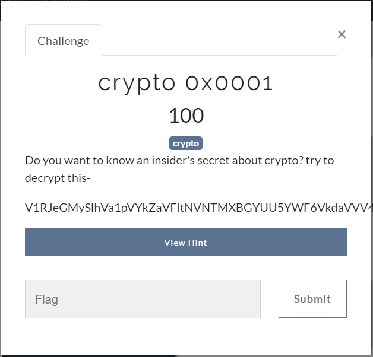
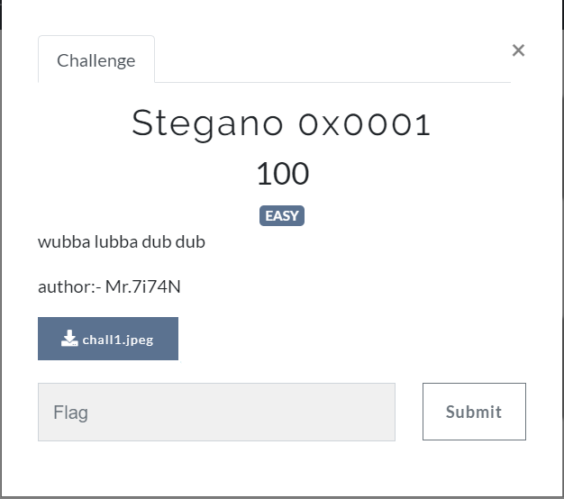
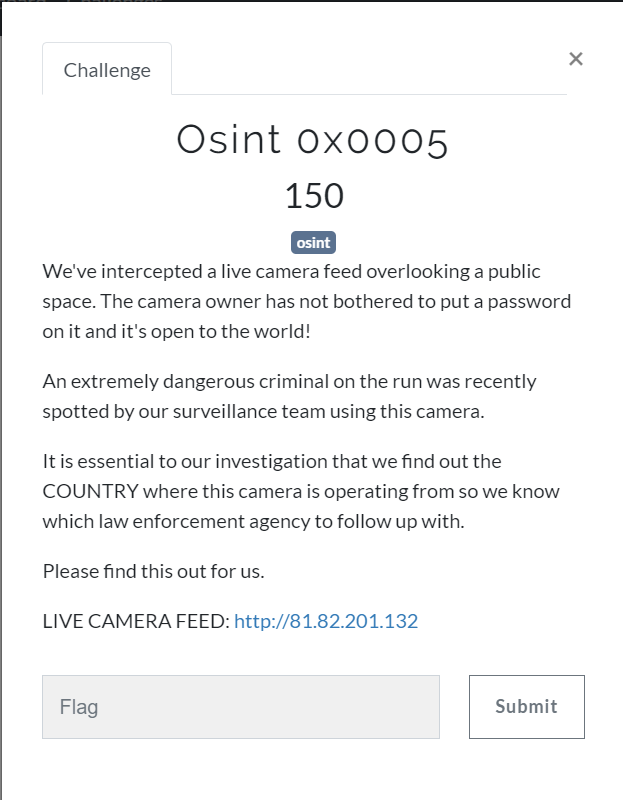
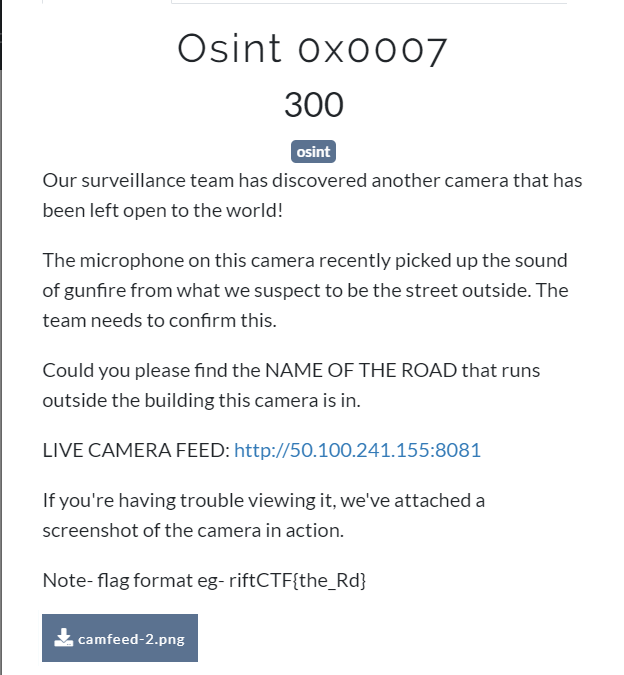
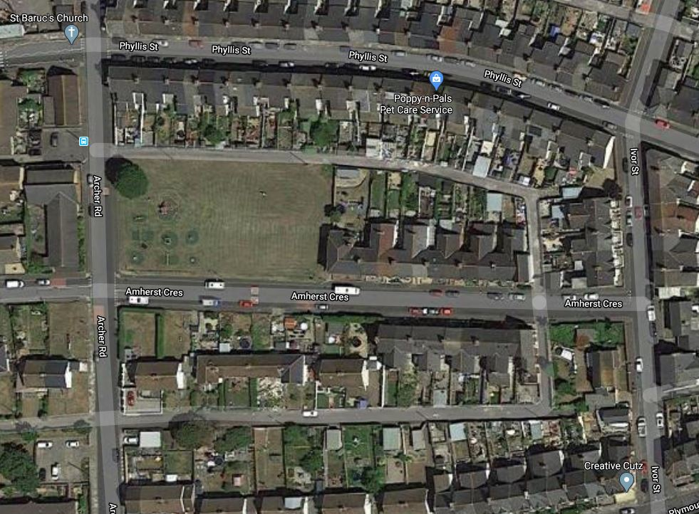
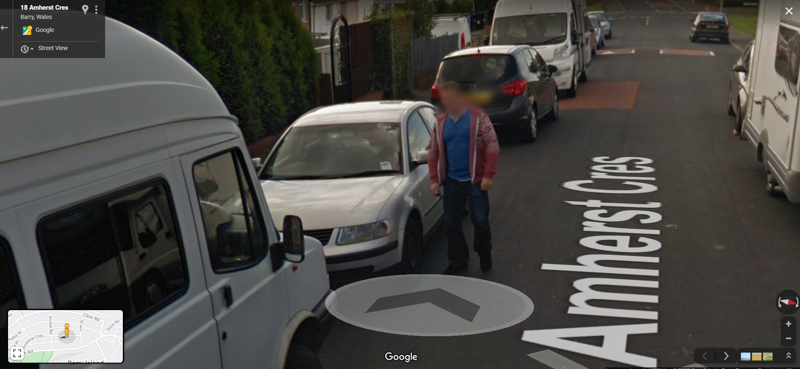

CTF page : http://riftctf.iiitnr.ac.in:8000/

# Cryptography

## crypto 0x0001		-		100 points



The full enrypted code is ``` V1RJeGMySlhVa1pVYkZaVFltNVNTMXBGYUU5YWF6VkdaVVV4V1UxclduQlVWV2hYVFVabmQxTnRhRlpsYXpRMQ== ```

This is a base64 multiple time encrpted code. 

flag - ``` riftCTF{Its_4LL_ab0ut_BaS3} ```

# Steganography

## Stegano 0x0001 - 100 points



The first thing I do with image file are use ``` strings ``` to find any important message. And here I got the flag using this only.

flag - ``` riftCTF{R1ck_4ND_the_r1ft} ```

# Reverse Engineering

## Rev 0x0001 - 50 points

! [](images/Rev0x0001.png)

The flag was not stored very secretly and can be easily discovered using ``` strings ```

flag - ``` riftCTF{tr4c1ng-mAkes-17-SUPeR-345Y} ```

# OSINT

## Osint 0x0005 - 150 points 



Using [IP Tracer](https://www.ip-tracker.org/) I found the country of cctv whose IP is 81.82.201.132

flag - ``` riftCTF{Belgium} ```

## Osint 0x0007 - 300 points



After opening the image folder "camfeed-2.png" we got this


After searching where is "The Birchmount Loft" in maps we found the road to be Birchmount Rd

flag - ``` riftCTF{Birchmount_Road} ```

## Osint 0x0008 - 300 points


We have been provided with a satellite image of a place where the suspect is present.



It is also said Google Car was present at the same time. That means if we inspect the area in 3D mode in Google maps we can get the person. After finding the place in google maps and searching in 3D mode we found him.



flag - ``` riftCTF{red_blue} ```

