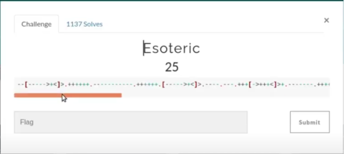
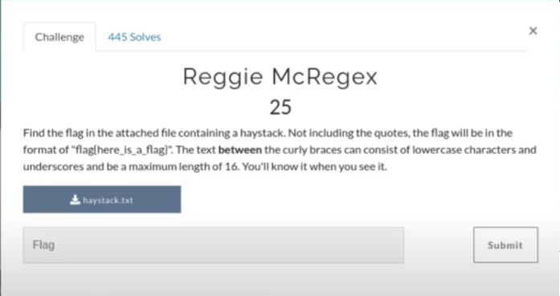

CTF page : https://tenable.ctfd.io/

# Misc

## Esoteric 	-		25 points



```--[----->+<]>.++++++.-----------.++++++.[----->+<]>.----.---.+++[->+++<]>+.-------.++++++++++.++++++++++.++[->+++<]>.+++.[--->+<]>----.+++[->+++<]>++.++++++++.+++++.--------.-[--->+<]>--.+[->+++<]>+.++++++++.>--[-->+++<]>.```

I was familiar with this cipher which is brainfuck cipher.
I used a online decoder to get the flag.

flag - ``` flag{wtf_is_brainfuck} ```


## Reggie mcgrex 	-		25 points



The file contains a large number of data with numerous "flag" word. So to get the correct flag we have to use regex
as per the given condition
- all lower case and underscore
- max length 16(I mistakenly assumed the actual length 16 but got the flag )

The regex will be ```flag{[a-z_]\{16,16\}}```

Now using grep we can get the correct flag

flag - ``` flag{thy_flag_is_this} ```


# Web App

## Source of all problems - 25 points

By just looking at the source code you will get the flag.

flag - ``` flag{best_implants_ever} ```


## Stay Away Creepy Crawlers - 25 points

From the word Crawler we can understand we have to look at the robots.txt of the ip and there you will get the flag.

flag - ``` flag{mr_roboto} ```
